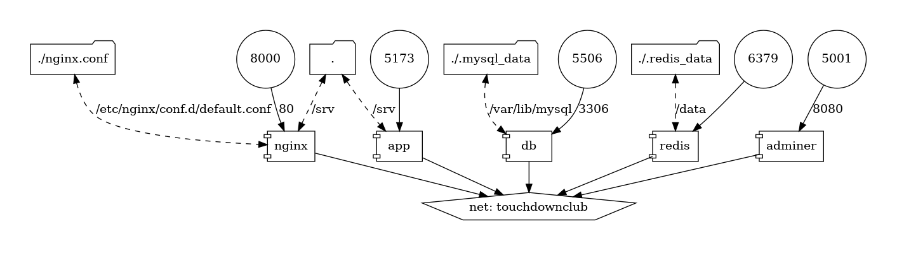

# Running the Touchdown Club Development Environment

To run the project in the development environment, you need to have `Make` and `Docker` installed on your machine. Follow the steps below to run your development server:

1. Build the image from the `dev.Dockerfile`:

Change your working directory to the project directory, then run the command `make` or `make build` on your terminal. If you prefer not to use `make`, you can always use regular Docker commands:

```shell
docker build \
	--build-arg user=$(whoami) --build-arg uid=$(id -u) --tag touchdownclub:dev --file dev.Dockerfile .
```

2. Run project containers:

The project has the following architecture:



You can use one of the commands below to run the project containers:

```shell
docker compose up     # Running in the foreground
docker compose up -d  # Running in the background (daemon mode)
```

3. Connect to the `app` container and install the required dependencies:

NOTE: Make sure that you are at the same level as the `docker-compose.yml` file.

```shell
docker compose exec app php # This will bind your shell to the application container shell

# On the application container shell, run:
composer install
npm install
cp .env.example .env
php artisan key:generate
php artisan migrate:fresh --seed
```

4. Restart the containers:

```shell
docker compose restart
```

5. Your application should be accessible at `http://localhost:8000/`.

Happy Coding!

## Vite developement server error


Within the project's Docker network, the **Vite server** is running inside a container called `vite`. On MAC OS, it may exhibit unexpected behavior (the server may hang on indefinitely without providing resources). Platforms running GNU/Linux don't show this behavior (Debian 11 and Fedora 38 have both been tested). You can access this open issue by visiting https://github.com/vitejs/vite/issues/11468 on Vite's Github issues page.

Stopping the `vite` container and manually building assets after each change to your assets file (app.js, app.css,...) will prevent this error. See the instructions below:

1. Stop `vite` container:

```shell
docker compose stop vite
```

2. You must manually run the build after binding to the `app` container shell after each change to your assets files:

```shell
docker compose exec app bash
npm run build
```

*Tip*: You can remove `vite` section from services list in "docker-compose.yml" if you don't want to stop `vite` container every time you run the project.
